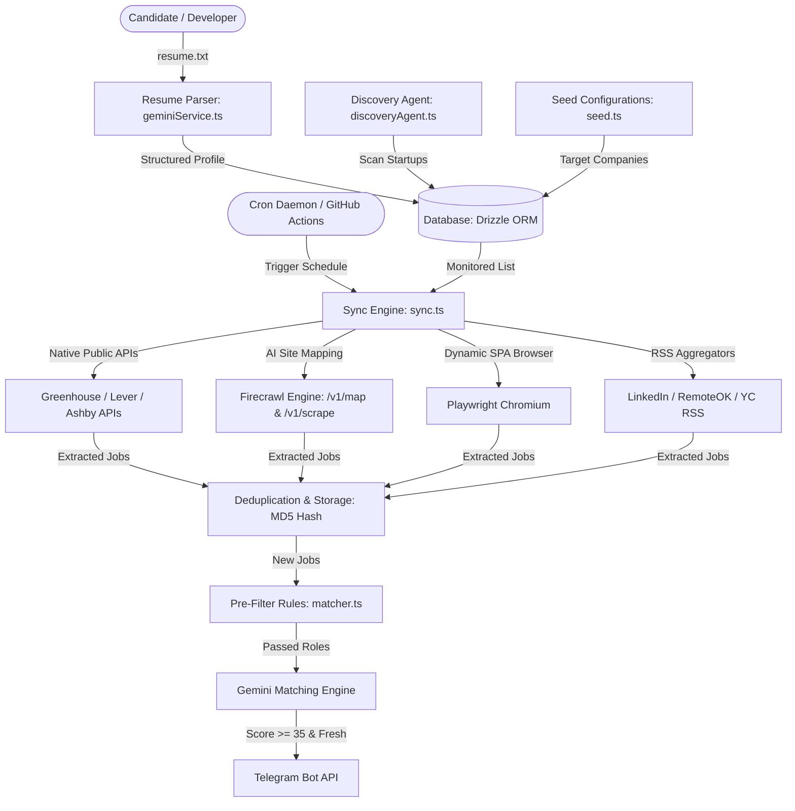
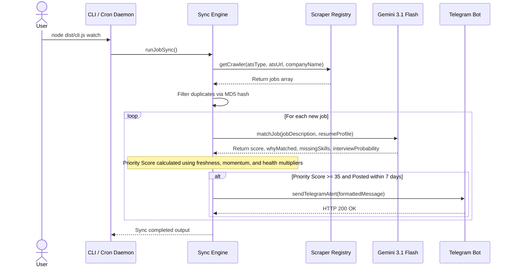

# Workflow: Autonomous AI Job Intelligence Platform | Node.js, TypeScript, Gemini 3.1 Flash, Firecrawl, Drizzle ORM, Telegram, Cron

An autonomous AI job discovery, evaluation, and alert platform tailored to candidate resume profiles. Integrates Google Gemini 3.1 Flash for multi-dimensional matching, Firecrawl for web scraping, Drizzle ORM for database management, Telegram for alerts, and node-cron for automated background scheduling.

[](https://nodejs.org/)
[](https://www.typescriptlang.org/)
[](https://aistudio.google.com/)
[](https://www.firecrawl.dev/)
[](https://orm.drizzle.team/)
[](https://telegram.org/)
[](https://www.npmjs.com/package/node-cron)

---

## Features

| Feature | Description |
|:---|:---|
| **AI Resume Parsing** | Extracts candidate skills, work history, projects, and domain focus into structured JSON using Gemini 3.1 Flash. |
| **Multi-Tier Hybrid Scraper** | Combines native ATS public JSON APIs, Firecrawl site mapping, Playwright headless browser fallback, and RSS aggregators. |
| **Multi-Dimensional Matching** | Calculates fit score (0-100), interview probability, key skill gaps, and custom resume recommendations. |
| **Startup Discovery Agent** | Automatically scans startup directories and Hacker News to discover unmonitored tech companies and register ATS configurations. |
| **Rich Alert Dispatcher** | Dispatches real-time structured notification cards to Telegram for high-priority matching job listings. |
| **Automated Background Cron** | Runs background monitoring daemons using node-cron and GitHub Actions scheduled jobs. |
| **Tailored Outreach Generation** | Generates personalized cold emails, LinkedIn connection requests, and referral notes tailored to specific job postings. |

---

## System Architecture



### Job Processing and Evaluation Sequence



---

## Technical Implementation

### AI Engine Integration
* **Structured Resume Parsing**: Raw resume text is processed through Google Gemini 3.1 Flash (`gemini-3.1-flash-lite`) enforcing a strict JSON schema output. The schema extracts candidate skills, experience, internships, projects, and technologies.
* **Job Matching Model**: Evaluates job descriptions against the candidate profile. Generates a numeric match score (0-100), interview probability (`High`, `Medium`, `Low`), missing skill gaps, and targeted resume optimization advice.
* **Priority Score Calculation**: Combines candidate match score with company hiring momentum, company health score, job freshness multiplier, and competition metrics:

```
Priority Score = MatchScore * (HiringMomentum / 100) * (CompanyHealth / 100) * FreshnessMultiplier * CompetitionMultiplier
```

### Refactored Scraper Architecture
To handle dynamic single-page applications, anti-bot protections, and varying career site layouts, the crawling model was refactored into a 4-tier hybrid architecture:

1. **Native ATS Public APIs**: Directly queries native public JSON endpoints for Greenhouse, Lever, and Ashby boards. Operates with sub-second latency and zero API cost.
2. **Firecrawl Integration**: Uses Firecrawl `/v1/map` to auto-discover job links on custom career portals without requiring manual DOM selectors, and `/v1/scrape` to fetch clean markdown descriptions while bypassing Cloudflare protection.
3. **Playwright Browser Fallback**: Spawns a headless Chromium instance with stealth headers for complex single-page applications when Firecrawl is not configured.
4. **RSS and Aggregator Crawlers**: Pulls remote and early-stage startup listings from RemoteOK and YC Jobs RSS feeds.

---

## Getting Started

### Prerequisites
* Node.js (v20 or newer)
* Google Gemini API key from Google AI Studio
* Firecrawl API key (optional, for custom career page scraping)
* Telegram Bot token and Chat ID (optional, for alerts)

### 1. Installation
Clone the repository and install dependencies:
```bash
git clone https://github.com/prakharp18/workflow.git
cd workflow
npm install
```

### 2. Configuration
Create a `.env` file in the root directory based on `.env.example`:
```env
DATABASE_URL=file:local.db
GEMINI_API_KEY=your_gemini_api_key_here
FIRECRAWL_API_KEY=fc-your_firecrawl_api_key_here
TELEGRAM_BOT_TOKEN=your_telegram_bot_token
TELEGRAM_CHAT_ID=your_telegram_chat_id
CRON_SCHEDULE="0 * * * *"
RESUME_PATH=resume.txt
```

### 3. Database Setup and Migration
Initialize the database and run migrations:
```bash
npm run build
npm run db:migrate
node dist/cli.js seed
```

---

## How to Use

### Direct CLI Commands
* **Run full manual job synchronization and evaluation:**
  ```bash
  node dist/cli.js sync
  ```
* **Seed database with target company list:**
  ```bash
  node dist/cli.js seed
  ```
* **Scan YC and Hacker News for new startups:**
  ```bash
  node dist/cli.js discover
  ```
* **Start background cron monitoring daemon:**
  ```bash
  node dist/cli.js watch
  ```

### Docker Deployment
Run using Docker Compose:
```bash
docker-compose up -d --build
```

---

## Data Schema

| Table | Description |
|:---|:---|
| **companies** | Tracks target companies, priority, sector, hiring momentum, and ATS metadata. |
| **jobs** | Stores scraped job postings, title, description, location, salary, and MD5 URL hash. |
| **job_matches** | Stores AI evaluation scores, match reasoning, missing skills, and interview probability. |
| **resume_profile** | Holds raw and parsed JSON candidate resume profile data. |
| **recruiters** | Monitored recruiter contacts for targeted outreach. |

---

## Contact

For questions or contributions, reach out at pporwal2019@gmail.com.
